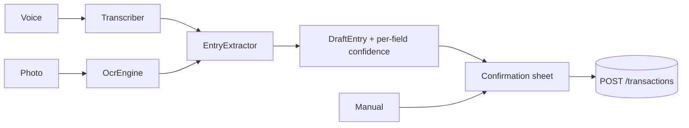

# Glaux Ledger

Bookkeeping for small shops. Record a sale or an expense in seconds, by voice, by photo
of a receipt, or by typing, instead of keeping a paper ledger.

Built mobile-first for someone standing at a shop counter, glancing at their phone
between customers.

## Architecture

Two deployables in one repo. Compose provides the database; application code runs
natively for fast reloads.

| Piece | Stack | Runs |
| --- | --- | --- |
| `backend/` | FastAPI, SQLAlchemy 2, Alembic, psycopg 3 | `uvicorn --reload`, deploys to Railway from its Dockerfile |
| `frontend/` | React, Vite, TypeScript, Tailwind v4 | `vite dev`, deploys to Cloudflare Pages as static output |
| `docker-compose.yml` | Postgres 17 | `docker compose up -d db` |

Only the database is containerised for development. Bind-mounted source in a container
makes file watching slow and unreliable on Windows, and the frontend ships as static
files anyway, so a dev container would buy nothing. The backend Dockerfile exists as the
production artifact; `docker compose --profile full up` runs it against the same
Postgres to check the image builds and boots before deploying.

### Stack choices that differ from the obvious ones

- **PyJWT, not python-jose.** python-jose is unmaintained; FastAPI's own docs moved to PyJWT.
- **pwdlib with Argon2, not passlib.** passlib does not work on Python 3.13+, which
  removed the stdlib `crypt` module it depends on (PEP 594).
- **psycopg 3, not psycopg2.** Better wheel coverage, and the driver SQLAlchemy 2 prefers.
- **Hand-rolled auth, not fastapi-users.** Registration has to create a business, its
  first user, and starter categories in one transaction. That is about 60 lines directly
  and more than that spent fighting the library's flow.

## Tenant isolation

Every business's data is isolated by `business_id`, enforced in four independent layers.
The goal is that skipping the filter requires actively fighting the code.

1. **The token is the only source of the tenant.** `get_current_business_id` reads the
   `biz` claim from the JWT. No route reads a business id from a path, query string, or
   body. A forged one in a request body is ignored, which
   [a test asserts](backend/tests/test_isolation.py).
2. **The repository applies the filter, not the route.** `TenantRepository` is built with
   a business id and its `select()` appends the predicate itself, so no caller can
   construct an unfiltered query through it. `add()` stamps the tenant and *rejects* a
   caller-supplied `business_id` rather than overwriting it.
3. **Cross-tenant foreign keys are resolved through the repository.** Posting a
   transaction against another business's `category_id` returns 404: absent, not
   forbidden, so the API does not confirm the row exists.
4. **Postgres row-level security as a net.** `categories` and `transactions` have
   `FORCE ROW LEVEL SECURITY` with a policy reading an `app.business_id` GUC that the
   session sets per transaction. A query that somehow reaches the database without its
   predicate returns nothing.

Two structural guards keep this from rotting:

- [`test_route_guard.py`](backend/tests/test_route_guard.py) walks the dependency tree
  FastAPI actually resolves and fails if any non-public route never reaches
  `get_current_business_id`. A new endpoint that forgets tenant scoping breaks the build.
  It also asserts that it *would* catch an offender, so it cannot pass vacuously.
- [`test_rls.py`](backend/tests/test_rls.py) runs deliberately unscoped SQL and asserts
  the database returns nothing, and first asserts the connected role is neither a
  superuser nor `BYPASSRLS`, since either would make RLS silently decorative.

### Why there are two database roles

Postgres ignores row-level security for superusers and for any role with `BYPASSRLS`.
The role `POSTGRES_USER` creates is a superuser, so an app connecting as it would get no
protection at all.

- `glaux` owns the schema and is what Alembic connects as (`MIGRATION_DATABASE_URL`).
- `glaux_app` is `NOSUPERUSER NOBYPASSRLS` and is what the API connects as
  (`DATABASE_URL`).

[`docker/postgres/init/01-app-role.sql`](docker/postgres/init/01-app-role.sql) creates
the second role and uses `ALTER DEFAULT PRIVILEGES` so tables Alembic creates later are
granted automatically, so no migration has to remember to issue a `GRANT`.

On a host that only gives you one owning role, omit `MIGRATION_DATABASE_URL` and
everything still works; you just lose the RLS layer and fall back to the three
application-level ones.

## Running it locally

Requires Docker Desktop, Python 3.12+, and Node 20+.

```bash
docker compose up -d db

cd backend
python -m venv .venv
.venv/Scripts/activate          # Windows;  source .venv/bin/activate elsewhere
pip install -r requirements-dev.txt
cp .env.example .env            # then set JWT_SECRET
alembic upgrade head
uvicorn app.main:app --reload
```

Interactive API docs land at http://localhost:8000/docs.

Generate a real `JWT_SECRET`. Startup fails if it is under 32 bytes, per RFC 7518 §3.2:

```bash
python -c "import secrets; print(secrets.token_urlsafe(48))"
```

Then the frontend, in a second terminal:

```bash
cd frontend
npm install
npm run dev
```

http://localhost:5173. The dev server proxies every API prefix to port 8000, so requests
are same-origin and CORS stays out of the way during development. The list lives in
`vite.config.ts`, and `src/lib/proxy.test.ts` checks it against the backend's routers:
an unproxied prefix does not error, it silently returns `index.html`, so the surface that
needed it just renders empty.

### Tests

```bash
cd backend
pytest
```

The suite builds a scratch `glaux_ledger_test` database, migrates it, and truncates
between tests, so it never touches development data.

`python smoke_e2e.py` walks the same paths over HTTP against a running server, useful
after a deploy, since it exercises the real ASGI stack, real uploads, and real PDF bytes
rather than the in-process test client.

```bash
cd frontend
npm test
```

Vitest and Testing Library, against the components where the logic is not obvious by
reading: what History does with a search that matches nothing, what BillsDue offers and
what it stays quiet about, what the billing panel says in each subscription state.

```bash
CHROME_PATH=... node tools/shoot.mjs   # add mobile|tablet|desktop|wide to narrow it
```

Registers a throwaway shop, seeds a day's trading including two unpaid bills and two
recurring ones, and writes `.shots/` at phone, tablet, laptop and 2560 width. The last is
there because a content cap that looks right on a laptop can leave a large monitor with a
column of content marooned between two hands' width of blank paper, and 1440 gives no
warning of it. Two separate attempts at that cap passed at 1440 and failed on a desk.

It then asserts the layout invariants that a screenshot cannot catch, because the fault
happens between frames: that the entry sheet is the same height in both directions, that
it opens with the amount focused, and that switching a period or a filter updates the
figures in place rather than emptying the page first. It exits non-zero if any of those
regress.

## Capturing an entry

Three ways in, one confirmation path. Voice and photo both return a *draft*. Nothing is
written until the shopkeeper confirms it in the bottom sheet, because a
misheard amount silently saved is worse than no feature at all.



`Transcriber`, `OcrEngine` and `EntryExtractor` are `Protocol`s picked by
`PARSER_PROVIDER`. The default needs no API key and no network:

- **Extraction is rule-based, and is the real default**, not a placeholder. It reads the
  phrasing a counter actually produces (`print 450`, `scan two hundred`,
  `paid 1200 for paper`), matches keywords to that shop's own categories, and handles the
  code-switched Sinhala/Tamil/English mix with Arabic digits that people actually speak.
- **Transcription and OCR are unavailable without a provider**, since neither can be done
  offline in pure Python. The frontend hides those capture actions when they are
  unavailable, so a stub can never be mistaken for a real reading. Setting
  `PARSER_PROVIDER=openai` with an `OPENAI_API_KEY` enables them and swaps in
  `gpt-4o-mini-transcribe` and a vision model; the extractor stays rule-based unless
  overridden, because it is cheaper, faster and already accurate on this vocabulary.

Every AI call is real money leaving a prepaid account on a route any signed-in shop can
hit in a loop, and the loop does not have to be malicious; a stuck retry will do. So
`AI_CALLS_PER_MONTH` caps it per shop per calendar month, on top of the per-minute rate
limit on the upload routes.

Fields the parser is unsure about arrive flagged in `uncertain` and are highlighted in the
sheet, so review effort goes where it is needed rather than being spread evenly.

## Reports and offline use

`GET /reports/export` renders a PDF through ReportLab: an income/expense/net band, a
daily cashflow bar chart, and a category breakdown. It is a summary for a landlord,
lender, or tax filing, not a transaction dump, which is what the History screen is for.
Pure Python, so there is no Cairo or GTK to install on the host.

The Export screen previews those same figures for the chosen range before building
anything, from `GET /transactions/summary?from_date=&to_date=`. A PDF is a slow and opaque
way to discover the dates were wrong, and the endpoint already answered the question.

*Caveat:* ReportLab has no HarfBuzz shaping, so Sinhala conjuncts in category names may
not compose correctly in the PDF. Amounts, dates, and Latin text are unaffected. Noted
rather than papered over.

The frontend is an installable PWA. The app shell is precached, so it opens from the home
screen and the last-seen dashboard still renders with no connection. Writes still require
the network; see the omissions below.

## Design

Ledger is the daylight member of Glaux's **NYX** system, which useglaux and Glaux Markets
also run. It keeps every identity-carrying token (gleam gold, verdigris and ember, the
Marcellus / Schibsted Grotesk / Spline Sans Mono trio, the 9/14/20 radius scale, the
three-duration motion language) and inverts only the surface.

That is a working decision, not a styling one. Markets is read at a desk, often at night,
where an unlit instrument panel is right. Ledger is read at a shop counter in daylight, on
a mid-range phone, where a dark interface cannot outrun the sun. Inverting the ground also
settles the family problem: Ledger is legibly a Glaux product without being a recolour of
Markets.

The brand colours could not be carried over unmodified: tuned for near-black, gleam
manages 1.76:1 on paper. [`frontend/tools/derive_palette.py`](frontend/tools/derive_palette.py)
holds each hue fixed in OKLCH and walks lightness down until it clears WCAG, so the
on-light siblings pass contrast while drifting under 3 degrees of hue. Run it before
changing a colour.

The app barely animates and the public pages animate a lot, which is one decision rather
than two. Inside, someone is mid-transaction with a customer waiting and nothing should
move under the thumb. On the landing page they are deciding, and the fastest way to
explain voice capture is to let them watch an entry arrive from it. The hero runs that
demo on a loop, in CSS, only while it is on screen, and hands reduced-motion readers the
finished day instead. See [the design spec](docs/design-spec.md#the-public-pages-are-the-exception-on-purpose).

## Selling it

A flat monthly fee per shop after a 30-day trial, collected by bank transfer. A shop
uploads its transfer slip from Billing, and a separately authenticated platform reviewer
approves or rejects it. Approval extends `paid_through` atomically; there is no card
processor, webhook, recurring charge, or payment-gateway configuration to operate.
Payment evidence is private, tenant-scoped, and only available to that shop and authorised
reviewers.

The state is derived rather than stored: a business has a `trial_ends_at` and a
`paid_through`, and `trialing` / `active` / `lapsed` is computed from them against the
shop's own timezone. Nothing has to run on a schedule to move an account between states,
which means nothing can fail to run.

**Lapsing stops writes and nothing else.** Reading, searching and PDF export keep working
permanently, and the app says so in the banner it shows. These are a business's financial
records, in many cases ones it is legally required to keep. Locking them behind a payment
would not be a pricing tactic, it would be holding a shop's own accounts to ransom.
`RequireActive` is on the write routes only, and
[a test asserts that for each state](backend/tests/test_billing.py).

## Documents

- [docs/design-spec.md](docs/design-spec.md): palette, type, layout, motion rules
- [docs/deployment.md](docs/deployment.md): Railway, Cloudflare Pages, CORS, what it costs, backups

The privacy policy and terms are pages in the app, at `/privacy` and `/terms`, rather than
files here: they are read by shopkeepers, not by developers, and a policy that only exists
in a repository is not one anyone has been shown.

## Design decisions worth knowing

**Timezones.** `businesses.timezone` (default `Asia/Colombo`) exists because "today's
total" is meaningless without it. Timestamps store as `timestamptz` in UTC, but day,
week, and month boundaries are computed in the shop's local time, then converted back to
UTC instants before querying, so the `(business_id, occurred_at)` index stays usable
instead of being defeated by a function call on the column.

**`occurred_at` is when the money moved; `created_at` is when it was typed.** Both are
kept. Every filter, total and report keys off the first; the second stays as the audit
trail, which is the only way a bill paid on Monday and entered on Friday can be both
correctly dated and honestly recorded.

**`entry_type` comes from the category, not the request.** A transaction cannot claim to
be income while filed under an expense category.

**Corrections void, they do not delete.** `voided_at` drops a row out of every total and
out of the default list while leaving it on the record. A book that can lose rows cannot
be audited.

**Aggregation happens in SQL.** Summaries group and sum in the database rather than
loading rows into Python.

**Nothing moves under the thumb.** This is a counter-side app used at speed, often
one-handed, and a control that shifts between the glance and the tap costs more than a
slow one. So: category chips sit in a fixed grid padded to the same cell count on both
sides, rather than wrapping to a different height per direction; lines that arrive with
the data have their space reserved before it does; and changing a period, filter or page
holds the previous answer on screen and fades it while the next loads, instead of
collapsing to a skeleton that is never the right height. `tools/shoot.mjs` asserts all of
this, since it is the kind of fault a screenshot cannot show.

## Deliberate omissions

- **Offline write queue.** Arguably the killer feature for a shop with patchy data, but
  real scope. The mutation layer is shaped so an IndexedDB outbox can be added without
  rework.
- **Refresh tokens.** A single long-lived access token (14 days) in `localStorage`
  instead. A shop device should not log out mid-shift. The tradeoff is XSS exposure and a
  token that cannot be revoked before expiry.
- **Receipt image storage.** Receipt photos are parsed and discarded, not retained.
  Payment slips are the narrow exception: they are kept as payment evidence and disclosed
  in the privacy policy.
- **Multiple users per business.** The schema supports it; there is no invite flow.
